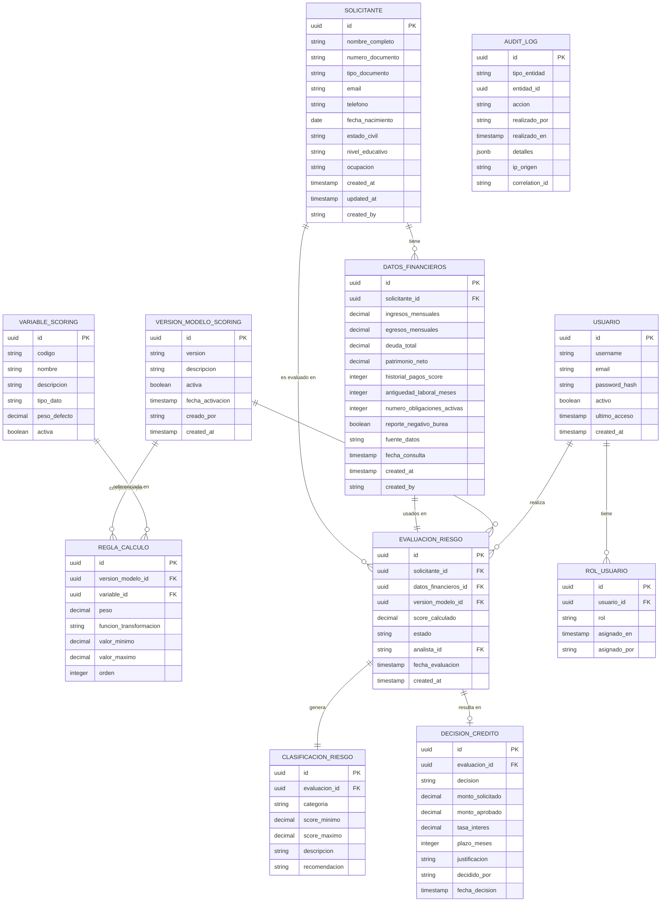
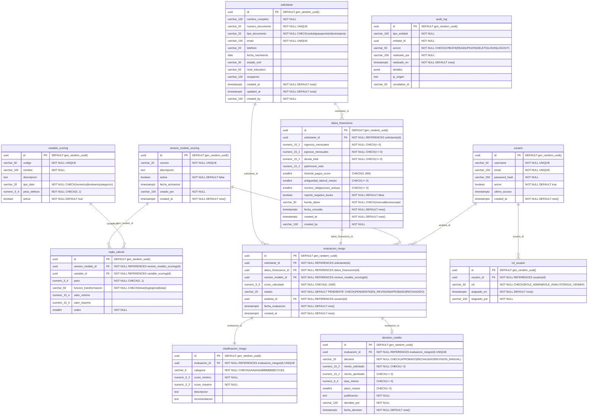

# Entity-Relationship Model — Credit Risk Scoring Engine

> Formato: Mermaid `erDiagram` (renderiza en GitHub, VS Code, Notion).
> Módulos afectados: `applicant`, `financialdata`, `scoring`, `evaluation`, `shared`.

---

## Modelo Lógico

El modelo lógico muestra entidades, atributos clave y relaciones sin tipos físicos.



---

## Modelo Físico

El modelo físico muestra tipos PostgreSQL, constraints e índices.



---

## Índices Recomendados

```sql
-- Búsquedas frecuentes de solicitantes
CREATE INDEX idx_solicitante_numero_documento ON solicitante(numero_documento);
CREATE INDEX idx_solicitante_email ON solicitante(email);

-- Historial de datos financieros por solicitante
CREATE INDEX idx_datos_financieros_solicitante ON datos_financieros(solicitante_id);

-- Evaluaciones por solicitante y estado
CREATE INDEX idx_evaluacion_solicitante ON evaluacion_riesgo(solicitante_id);
CREATE INDEX idx_evaluacion_estado ON evaluacion_riesgo(estado);
CREATE INDEX idx_evaluacion_analista ON evaluacion_riesgo(analista_id);

-- Auditoría: búsqueda por entidad y acción
CREATE INDEX idx_audit_entidad ON audit_log(tipo_entidad, entidad_id);
CREATE INDEX idx_audit_realizado_por ON audit_log(realizado_por);
CREATE INDEX idx_audit_fecha ON audit_log(realizado_en DESC);

-- Modelo de scoring activo
CREATE UNIQUE INDEX idx_version_modelo_activa ON version_modelo_scoring(activa)
    WHERE activa = true;
```

---

## Notas de Diseño

- Todas las PKs son `UUID` generados por PostgreSQL (`gen_random_uuid()`), no secuencias enteras.
- `TIMESTAMPTZ` en lugar de `TIMESTAMP` para correcta gestión de zonas horarias.
- `audit_log.detalles` es `JSONB` para almacenar el estado anterior/posterior del recurso sin esquema fijo.
- La columna `version_modelo_scoring.activa` tiene índice único parcial para garantizar que solo un modelo esté activo a la vez.
- `decision_credito` y `clasificacion_riesgo` tienen FK con `UNIQUE` constraint sobre `evaluacion_id` → relación 1:1.
