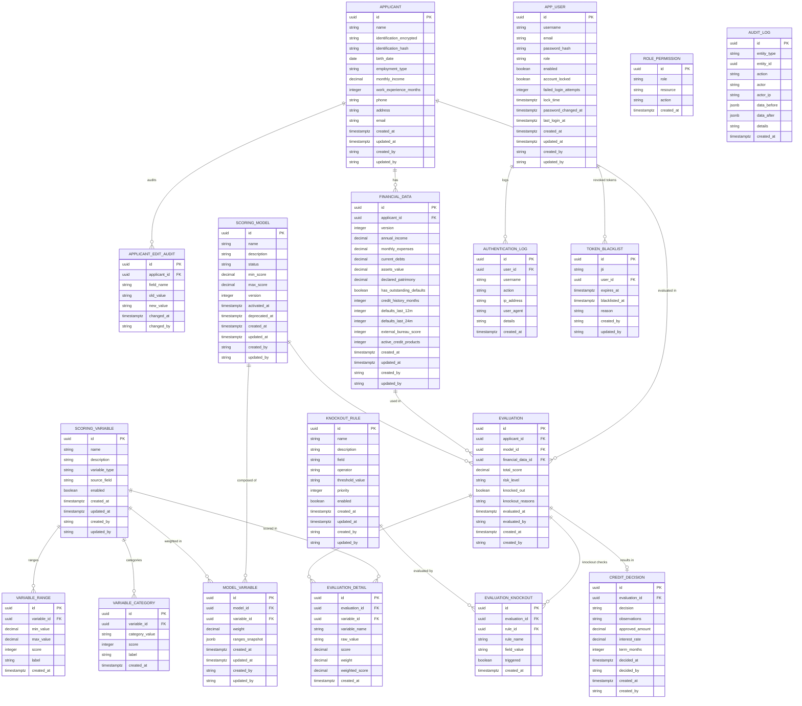

# Entity-Relationship Model — Credit Risk Scoring Engine

> Formato: Mermaid `erDiagram` (renderiza en GitHub, VS Code, Notion).
> Módulos afectados: `applicant`, `financialdata`, `scoring`, `evaluation`, `shared`.
> Alineado con: Flyway migrations V1–V19 (fuente de verdad).
> Última sincronización: 2026-04-05.

---

## Modelo Lógico

El modelo lógico muestra entidades, atributos clave y relaciones sin tipos físicos.



---

## Modelo Físico

El modelo físico muestra tipos PostgreSQL, constraints e índices alineados con las migraciones Flyway V1–V19.

```mermaid
erDiagram
    applicant {
        uuid id PK "DEFAULT gen_random_uuid()"
        varchar_150 name "NOT NULL"
        varchar_700 identification_encrypted "NOT NULL"
        varchar_128 identification_hash "NOT NULL UNIQUE"
        date birth_date "NOT NULL"
        varchar_30 employment_type "NOT NULL"
        numeric_19_2 monthly_income "NOT NULL"
        integer work_experience_months "NOT NULL"
        varchar_20 phone "NULL"
        varchar_500 address "NULL"
        varchar_255 email "NULL"
        timestamptz created_at "NOT NULL"
        timestamptz updated_at
        varchar_100 created_by "NOT NULL"
        varchar_100 updated_by
    }

    applicant_edit_audit {
        uuid id PK "DEFAULT gen_random_uuid()"
        uuid applicant_id FK "NOT NULL REFERENCES applicant(id)"
        varchar_100 field_name "NOT NULL"
        varchar_500 old_value
        varchar_500 new_value
        timestamptz changed_at "NOT NULL"
        varchar_100 changed_by "NOT NULL"
    }

    financial_data {
        uuid id PK "DEFAULT gen_random_uuid()"
        uuid applicant_id FK "NOT NULL REFERENCES applicant(id)"
        integer version "NOT NULL DEFAULT 1"
        numeric_19_2 annual_income "NOT NULL CHECK >= 0"
        numeric_19_2 monthly_expenses "NOT NULL CHECK >= 0"
        numeric_19_2 current_debts "NOT NULL CHECK >= 0"
        numeric_19_2 assets_value "NOT NULL CHECK >= 0"
        numeric_19_2 declared_patrimony "NOT NULL CHECK >= 0"
        boolean has_outstanding_defaults "NOT NULL DEFAULT false"
        integer credit_history_months "NOT NULL CHECK >= 0"
        integer defaults_last_12m "NOT NULL DEFAULT 0 CHECK >= 0"
        integer defaults_last_24m "NOT NULL DEFAULT 0 CHECK >= 0"
        integer external_bureau_score "NULL CHECK 0-999"
        integer active_credit_products "NOT NULL DEFAULT 0 CHECK >= 0"
        timestamptz created_at "NOT NULL"
        timestamptz updated_at
        varchar_100 created_by "NOT NULL"
        varchar_100 updated_by
    }

    scoring_model {
        uuid id PK "DEFAULT gen_random_uuid()"
        varchar_100 name "NOT NULL"
        varchar_500 description
        varchar_20 status "NOT NULL CHECK(DRAFT ACTIVE DEPRECATED)"
        numeric_5_2 min_score "NOT NULL DEFAULT 0 CHECK >= 0"
        numeric_5_2 max_score "NOT NULL DEFAULT 100 CHECK <= 1000"
        integer version "NOT NULL DEFAULT 1"
        timestamptz activated_at
        timestamptz deprecated_at
        timestamptz created_at "NOT NULL"
        timestamptz updated_at
        varchar_100 created_by "NOT NULL"
        varchar_100 updated_by
    }

    scoring_variable {
        uuid id PK "DEFAULT gen_random_uuid()"
        varchar_100 name "NOT NULL UNIQUE"
        varchar_500 description
        varchar_20 variable_type "NOT NULL CHECK(NUMERIC CATEGORICAL)"
        varchar_100 source_field "NOT NULL"
        boolean enabled "NOT NULL DEFAULT true"
        timestamptz created_at "NOT NULL"
        timestamptz updated_at
        varchar_100 created_by "NOT NULL"
        varchar_100 updated_by
    }

    model_variable {
        uuid id PK "DEFAULT gen_random_uuid()"
        uuid model_id FK "NOT NULL REFERENCES scoring_model(id)"
        uuid variable_id FK "NOT NULL REFERENCES scoring_variable(id)"
        numeric_5_4 weight "NOT NULL CHECK > 0 AND <= 1"
        jsonb ranges_snapshot
        timestamptz created_at "NOT NULL"
        timestamptz updated_at
        varchar_100 created_by "NOT NULL"
        varchar_100 updated_by
    }

    variable_range {
        uuid id PK "DEFAULT gen_random_uuid()"
        uuid variable_id FK "NOT NULL REFERENCES scoring_variable(id)"
        numeric_19_2 min_value "NOT NULL"
        numeric_19_2 max_value "NOT NULL CHECK min < max"
        integer score "NOT NULL CHECK 0-100"
        varchar_50 label
        timestamptz created_at "NOT NULL"
    }

    variable_category {
        uuid id PK "DEFAULT gen_random_uuid()"
        uuid variable_id FK "NOT NULL REFERENCES scoring_variable(id)"
        varchar_100 category_value "NOT NULL"
        integer score "NOT NULL CHECK 0-100"
        varchar_50 label
        timestamptz created_at "NOT NULL"
    }

    knockout_rule {
        uuid id PK "DEFAULT gen_random_uuid()"
        varchar_100 name "NOT NULL"
        varchar_500 description
        varchar_100 field "NOT NULL"
        varchar_20 operator "NOT NULL CHECK(EQ NE GT LT GE LE IN NI)"
        varchar_255 threshold_value "NOT NULL"
        integer priority "NOT NULL DEFAULT 0"
        boolean enabled "NOT NULL DEFAULT true"
        timestamptz created_at "NOT NULL"
        timestamptz updated_at
        varchar_100 created_by "NOT NULL"
        varchar_100 updated_by
    }

    evaluation {
        uuid id PK "DEFAULT gen_random_uuid()"
        uuid applicant_id FK "NOT NULL REFERENCES applicant(id)"
        uuid model_id FK "NOT NULL REFERENCES scoring_model(id)"
        uuid financial_data_id FK "NOT NULL REFERENCES financial_data(id)"
        numeric_5_2 total_score "NOT NULL CHECK 0-100"
        varchar_20 risk_level "NOT NULL CHECK(VL L M H VH)"
        boolean knocked_out "NOT NULL DEFAULT false"
        varchar_1000 knockout_reasons
        timestamptz evaluated_at "NOT NULL"
        varchar_100 evaluated_by "NOT NULL"
        timestamptz created_at "NOT NULL"
        varchar_100 created_by "NOT NULL"
    }

    evaluation_detail {
        uuid id PK "DEFAULT gen_random_uuid()"
        uuid evaluation_id FK "NOT NULL REFERENCES evaluation(id) CASCADE"
        uuid variable_id FK "NOT NULL REFERENCES scoring_variable(id)"
        varchar_100 variable_name "NOT NULL"
        varchar_255 raw_value "NOT NULL"
        numeric_5_2 score "NOT NULL CHECK 0-100"
        numeric_5_4 weight "NOT NULL"
        numeric_5_2 weighted_score "NOT NULL"
        timestamptz created_at "NOT NULL"
    }

    evaluation_knockout {
        uuid id PK "DEFAULT gen_random_uuid()"
        uuid evaluation_id FK "NOT NULL REFERENCES evaluation(id) CASCADE"
        uuid rule_id FK "NOT NULL REFERENCES knockout_rule(id)"
        varchar_100 rule_name "NOT NULL"
        varchar_255 field_value "NOT NULL"
        boolean triggered "NOT NULL"
        timestamptz created_at "NOT NULL"
    }

    credit_decision {
        uuid id PK "DEFAULT gen_random_uuid()"
        uuid evaluation_id FK "NOT NULL UNIQUE REFERENCES evaluation(id)"
        varchar_20 decision "NOT NULL CHECK(APPROVED REJECTED MANUAL_REVIEW)"
        varchar_2000 observations "NOT NULL CHECK len >= 20"
        numeric_19_2 approved_amount "CHECK >= 0"
        numeric_5_2 interest_rate "CHECK 0-100"
        integer term_months "CHECK > 0"
        timestamptz decided_at "NOT NULL"
        varchar_100 decided_by "NOT NULL"
        timestamptz created_at "NOT NULL"
        varchar_100 created_by "NOT NULL"
    }

    app_user {
        uuid id PK "DEFAULT gen_random_uuid()"
        varchar_50 username "NOT NULL UNIQUE"
        varchar_255 email "NOT NULL UNIQUE"
        varchar_255 password_hash "NOT NULL"
        varchar_30 role "NOT NULL CHECK(ADMIN ANALYST RISK_MANAGER CREDIT_SUPERVISOR)"
        boolean enabled "NOT NULL DEFAULT true"
        boolean account_locked "NOT NULL DEFAULT false"
        integer failed_login_attempts "NOT NULL DEFAULT 0"
        timestamptz lock_time
        timestamptz password_changed_at "NOT NULL"
        timestamptz last_login_at
        timestamptz created_at "NOT NULL"
        timestamptz updated_at
        varchar_100 created_by "NOT NULL"
        varchar_100 updated_by
    }

    role_permission {
        uuid id PK "DEFAULT gen_random_uuid()"
        varchar_30 role "NOT NULL"
        varchar_50 resource "NOT NULL"
        varchar_30 action "NOT NULL"
        timestamptz created_at "NOT NULL"
    }

    authentication_log {
        uuid id PK "DEFAULT gen_random_uuid()"
        uuid user_id FK "REFERENCES app_user(id)"
        varchar_50 username "NOT NULL"
        varchar_30 action "NOT NULL CHECK(LOGIN_SUCCESS LOGIN_FAILURE LOGOUT ...)"
        varchar_45 ip_address "NOT NULL"
        varchar_500 user_agent
        varchar_500 details
        timestamptz created_at "NOT NULL"
    }

    token_blacklist {
        uuid id PK "DEFAULT gen_random_uuid()"
        varchar_255 jti "NOT NULL UNIQUE"
        uuid user_id FK "NOT NULL REFERENCES app_user(id)"
        timestamptz expires_at "NOT NULL"
        timestamptz blacklisted_at "NOT NULL"
        varchar_100 reason
        varchar_100 created_by
        varchar_100 updated_by
    }

    audit_log {
        uuid id PK "DEFAULT gen_random_uuid()"
        varchar_50 entity_type "NOT NULL"
        uuid entity_id "NOT NULL"
        varchar_30 action "NOT NULL CHECK(CREATE UPDATE DELETE READ LOGIN LOGOUT EVALUATE DECIDE)"
        varchar_100 actor "NOT NULL"
        varchar_45 actor_ip
        jsonb data_before
        jsonb data_after
        varchar_1000 details
        timestamptz created_at "NOT NULL DEFAULT now()"
    }

    applicant ||--o{ applicant_edit_audit : "applicant_id"
    applicant ||--o{ financial_data : "applicant_id"
    applicant ||--o{ evaluation : "applicant_id"
    financial_data ||--o{ evaluation : "financial_data_id"
    scoring_model ||--o{ model_variable : "model_id"
    scoring_model ||--o{ evaluation : "model_id"
    scoring_variable ||--o{ model_variable : "variable_id"
    scoring_variable ||--o{ variable_range : "variable_id"
    scoring_variable ||--o{ variable_category : "variable_id"
    scoring_variable ||--o{ evaluation_detail : "variable_id"
    evaluation ||--o{ evaluation_detail : "evaluation_id"
    evaluation ||--o{ evaluation_knockout : "evaluation_id"
    evaluation ||--o| credit_decision : "evaluation_id"
    knockout_rule ||--o{ evaluation_knockout : "rule_id"
    app_user ||--o{ authentication_log : "user_id"
    app_user ||--o{ token_blacklist : "user_id"
```



---

## Índices

```sql
-- Applicant
CREATE UNIQUE INDEX uk_applicant_identification_hash ON applicant (identification_hash);

-- Applicant Edit Audit
CREATE INDEX idx_applicant_edit_audit_applicant ON applicant_edit_audit (applicant_id, changed_at DESC);

-- Financial Data
CREATE UNIQUE INDEX uk_financial_data_applicant_version ON financial_data (applicant_id, version);
CREATE INDEX idx_financial_data_applicant ON financial_data (applicant_id);

-- App User
CREATE INDEX idx_app_user_role ON app_user (role);
CREATE INDEX idx_app_user_enabled ON app_user (enabled) WHERE enabled = true;

-- Auth Log
CREATE INDEX idx_auth_log_user_action ON authentication_log (user_id, action, created_at);
CREATE INDEX idx_auth_log_created_at ON authentication_log (created_at);

-- Token Blacklist
CREATE INDEX idx_token_blacklist_jti ON token_blacklist (jti);
CREATE INDEX idx_token_blacklist_expires_at ON token_blacklist (expires_at);

-- Scoring Model
CREATE UNIQUE INDEX uk_scoring_model_active ON scoring_model (status) WHERE status = 'ACTIVE';
CREATE INDEX idx_scoring_model_status ON scoring_model (status);

-- Model Variable
CREATE UNIQUE INDEX uk_model_variable_model_variable ON model_variable (model_id, variable_id);
CREATE INDEX idx_model_variable_model ON model_variable (model_id);
CREATE INDEX idx_model_variable_variable ON model_variable (variable_id);

-- Variable Range / Category
CREATE INDEX idx_variable_range_variable ON variable_range (variable_id);
CREATE UNIQUE INDEX uk_variable_category_variable_value ON variable_category (variable_id, category_value);
CREATE INDEX idx_variable_category_variable ON variable_category (variable_id);

-- Knockout Rule
CREATE INDEX idx_knockout_rule_enabled ON knockout_rule (enabled, priority) WHERE enabled = true;

-- Evaluation
CREATE INDEX idx_evaluation_applicant_date ON evaluation (applicant_id, evaluated_at DESC);
CREATE INDEX idx_evaluation_risk_level ON evaluation (risk_level);
CREATE INDEX idx_evaluation_model ON evaluation (model_id);
CREATE INDEX idx_evaluation_evaluated_at ON evaluation (evaluated_at);

-- Evaluation Detail
CREATE INDEX idx_evaluation_detail_evaluation ON evaluation_detail (evaluation_id);

-- Evaluation Knockout
CREATE INDEX idx_evaluation_knockout_evaluation ON evaluation_knockout (evaluation_id);
CREATE INDEX idx_evaluation_knockout_triggered ON evaluation_knockout (evaluation_id) WHERE triggered = true;

-- Credit Decision
CREATE INDEX idx_credit_decision_evaluation ON credit_decision (evaluation_id);
CREATE INDEX idx_credit_decision_decision ON credit_decision (decision);
CREATE INDEX idx_credit_decision_decided_at ON credit_decision (decided_at);

-- Audit Log
CREATE INDEX idx_audit_log_entity ON audit_log (entity_type, entity_id);
CREATE INDEX idx_audit_log_actor ON audit_log (actor);
CREATE INDEX idx_audit_log_created_at ON audit_log (created_at);
```

---

## Stored Procedures & Views

```sql
-- Function: recalculate_risk_distribution(p_from_date, p_to_date)
-- Returns risk level distribution with statistics for a given date range.

-- Function: cleanup_expired_tokens()
-- Purges expired entries from token_blacklist. Returns count of deleted rows.

-- View: vw_financial_data_with_ratios
-- Enriches financial_data with: debt_to_income_ratio, expenses_to_income_ratio, net_patrimony.

-- View: vw_evaluation_summary
-- Consolidated evaluation view with applicant, model, and decision data.
```

---

## Notas de Diseño

- Todas las PKs son `UUID` generados por PostgreSQL (`gen_random_uuid()`), no secuencias enteras.
- `TIMESTAMPTZ` en lugar de `TIMESTAMP` para correcta gestión de zonas horarias.
- `app_user.role` es un `VARCHAR(30)` con CHECK constraint (enum). La relación con `role_permission` es lógica (por nombre de rol), no por FK UUID.
- `audit_log.data_before` / `data_after` son `JSONB` para almacenar el estado anterior/posterior del recurso sin esquema fijo.
- `scoring_model.status` tiene índice único parcial `WHERE status = 'ACTIVE'` para garantizar que solo un modelo esté activo a la vez.
- `credit_decision` tiene FK con `UNIQUE` constraint sobre `evaluation_id` → relación 1:1.
- Tablas `evaluation`, `evaluation_detail`, `evaluation_knockout` y `credit_decision` son **inmutables** (no tienen `updated_at`/`updated_by`).
- `financial_data` usa versionado por `(applicant_id, version)` con UNIQUE constraint.

---

## Historial de alineación con HU

| HU | Campo | Tabla | Migración |
|----|-------|-------|-----------|
| HU-001 | Dirección del solicitante | `applicant.address` | V19 |
| HU-001 | Correo electrónico del solicitante | `applicant.email` | V19 |
| HU-004 | Moras últimos 12 meses | `financial_data.defaults_last_12m` | V19 |
| HU-004 | Moras últimos 24 meses | `financial_data.defaults_last_24m` | V19 |
| HU-004 | Score bureau externo | `financial_data.external_bureau_score` | V19 |
| HU-004 | Productos crediticios vigentes | `financial_data.active_credit_products` | V19 |
