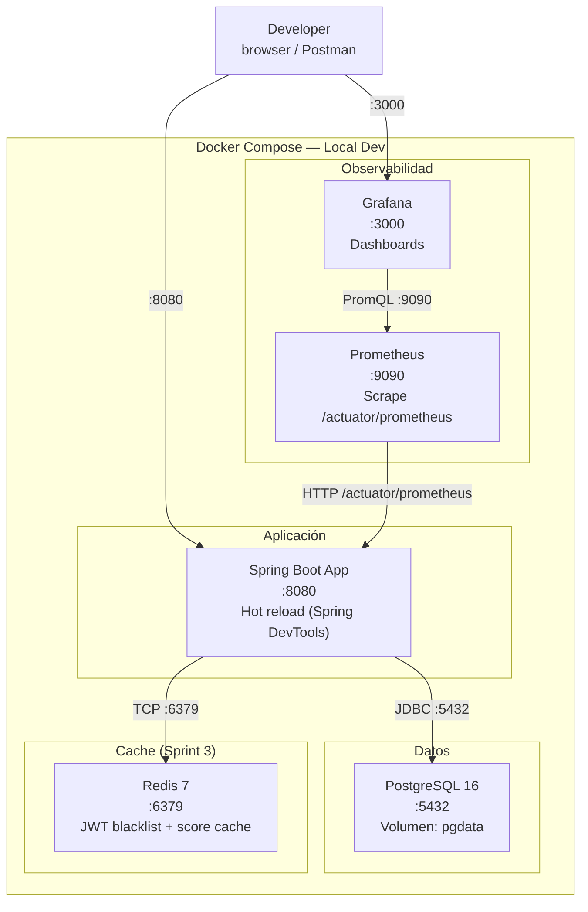
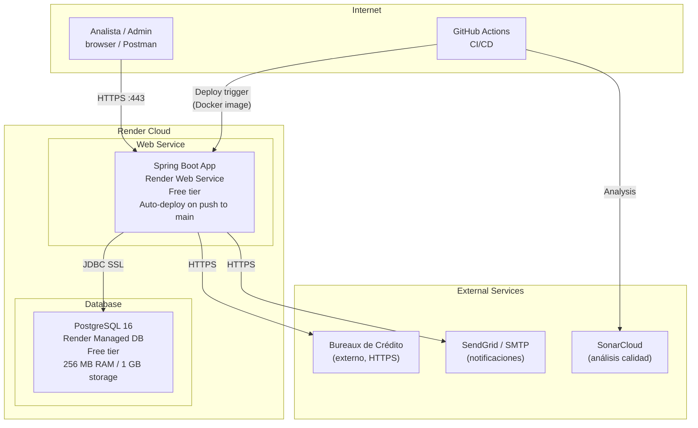
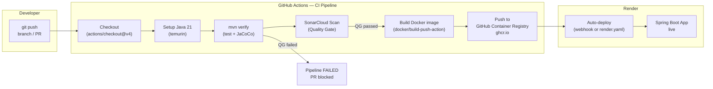
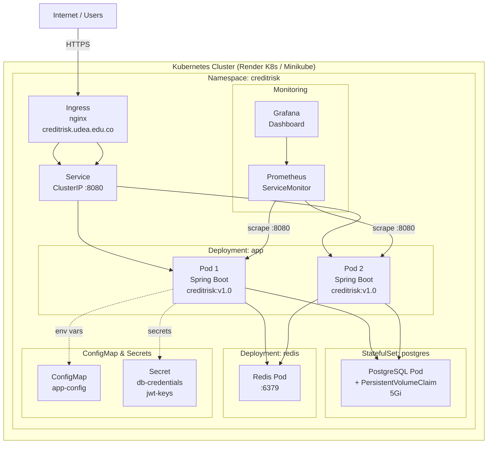

# Deployment Diagrams — Credit Risk Scoring Engine

> Diagramas Mermaid para: desarrollo local (Docker Compose), producción (Render), CI/CD (GitHub Actions), Kubernetes (Sprint 3).

---

## 1. Desarrollo Local — Docker Compose



### docker-compose.yml (fragmento)

```yaml
services:
  app:
    build: .
    ports: ["8080:8080"]
    environment:
      SPRING_DATASOURCE_URL: jdbc:postgresql://postgres:5432/creditrisk
      SPRING_DATASOURCE_USERNAME: creditrisk_app
      SPRING_DATASOURCE_PASSWORD: local_password
    depends_on:
      postgres:
        condition: service_healthy

  postgres:
    image: postgres:16-alpine
    ports: ["5432:5432"]
    environment:
      POSTGRES_DB: creditrisk
      POSTGRES_USER: creditrisk_app
      POSTGRES_PASSWORD: local_password
    volumes:
      - pgdata:/var/lib/postgresql/data
    healthcheck:
      test: ["CMD-SHELL", "pg_isready -U creditrisk_app -d creditrisk"]
      interval: 5s
      timeout: 5s
      retries: 5

  prometheus:
    image: prom/prometheus:latest
    ports: ["9090:9090"]
    volumes:
      - ./docker/prometheus.yml:/etc/prometheus/prometheus.yml

  grafana:
    image: grafana/grafana:latest
    ports: ["3000:3000"]
    environment:
      GF_SECURITY_ADMIN_PASSWORD: admin
    volumes:
      - grafana_data:/var/lib/grafana

volumes:
  pgdata:
  grafana_data:
```

---

## 2. Producción — Render



### Variables de entorno en Render (Environment)

```
SPRING_DATASOURCE_URL=jdbc:postgresql://{render-db-host}:5432/creditrisk
SPRING_DATASOURCE_USERNAME=creditrisk_app
SPRING_DATASOURCE_PASSWORD={secret}
JWT_PRIVATE_KEY={rs256-private-key-base64}
JWT_PUBLIC_KEY={rs256-public-key-base64}
SPRING_PROFILES_ACTIVE=prod
```

---

## 3. CI/CD — GitHub Actions



### `.github/workflows/ci.yml` (fragmento)

```yaml
name: CI/CD Pipeline

on:
  push:
    branches: [main, develop]
  pull_request:
    branches: [main]

jobs:
  build-and-test:
    runs-on: ubuntu-latest
    steps:
      - uses: actions/checkout@v4
        with:
          fetch-depth: 0  # SonarCloud necesita historial completo

      - uses: actions/setup-java@v4
        with:
          java-version: '21'
          distribution: 'temurin'
          cache: maven

      - name: Build and test
        run: mvn verify -B

      - name: SonarCloud Scan
        uses: SonarSource/sonarcloud-github-action@master
        env:
          GITHUB_TOKEN: ${{ secrets.GITHUB_TOKEN }}
          SONAR_TOKEN: ${{ secrets.SONAR_TOKEN }}

  docker-build:
    needs: build-and-test
    runs-on: ubuntu-latest
    if: github.ref == 'refs/heads/main'
    steps:
      - uses: actions/checkout@v4

      - uses: docker/build-push-action@v5
        with:
          context: .
          push: true
          tags: ghcr.io/${{ github.repository }}:latest
```

---

## 4. Kubernetes — Sprint 3



### `k8s/deployment.yaml` (fragmento)

```yaml
apiVersion: apps/v1
kind: Deployment
metadata:
  name: creditrisk-app
  namespace: creditrisk
spec:
  replicas: 2
  selector:
    matchLabels:
      app: creditrisk-app
  template:
    metadata:
      labels:
        app: creditrisk-app
    spec:
      containers:
        - name: app
          image: ghcr.io/udea/credit-risk-scoring-engine:latest
          ports:
            - containerPort: 8080
          envFrom:
            - configMapRef:
                name: app-config
            - secretRef:
                name: db-credentials
          livenessProbe:
            httpGet:
              path: /actuator/health/liveness
              port: 8080
            initialDelaySeconds: 30
          readinessProbe:
            httpGet:
              path: /actuator/health/readiness
              port: 8080
            initialDelaySeconds: 10
          resources:
            requests:
              memory: "256Mi"
              cpu: "250m"
            limits:
              memory: "512Mi"
              cpu: "500m"
```

---

## Dockerfile

```dockerfile
# Multi-stage build
FROM eclipse-temurin:21-jdk-alpine AS builder
WORKDIR /app
COPY .mvn/ .mvn/
COPY mvnw pom.xml ./
RUN ./mvnw dependency:go-offline -B
COPY src/ src/
RUN ./mvnw package -DskipTests -B

FROM eclipse-temurin:21-jre-alpine AS runtime
WORKDIR /app
RUN addgroup -S appgroup && adduser -S appuser -G appgroup
COPY --from=builder /app/target/*.jar app.jar
USER appuser
EXPOSE 8080
ENTRYPOINT ["java", "-jar", "app.jar"]
```
